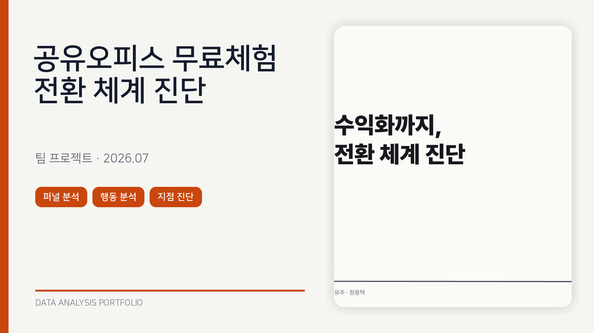
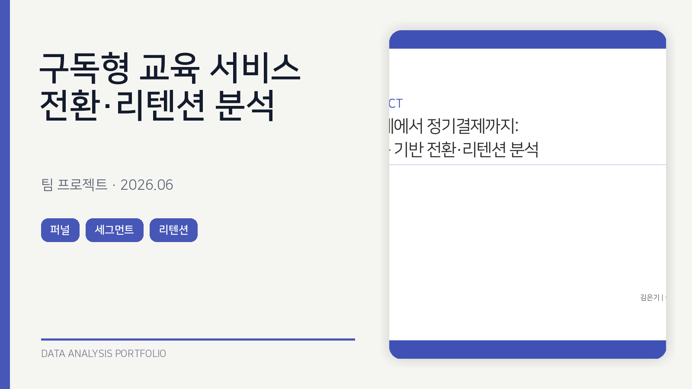
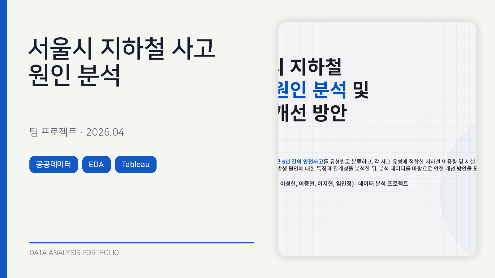
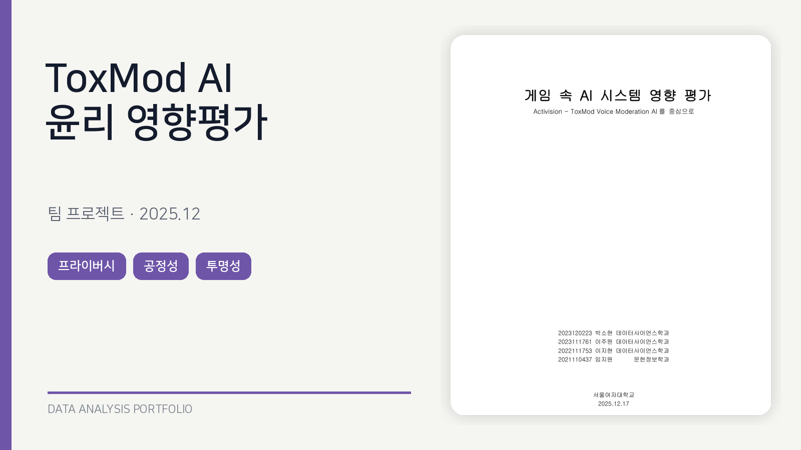
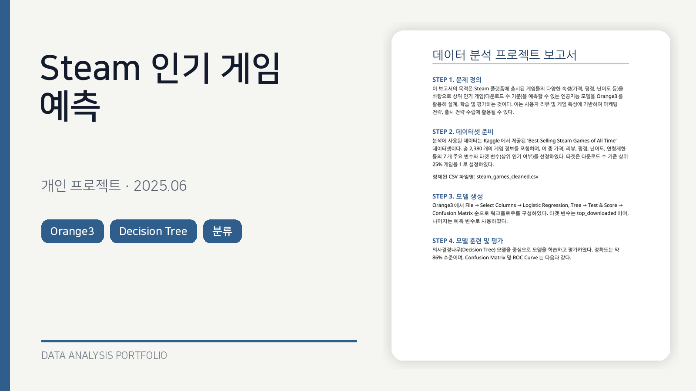
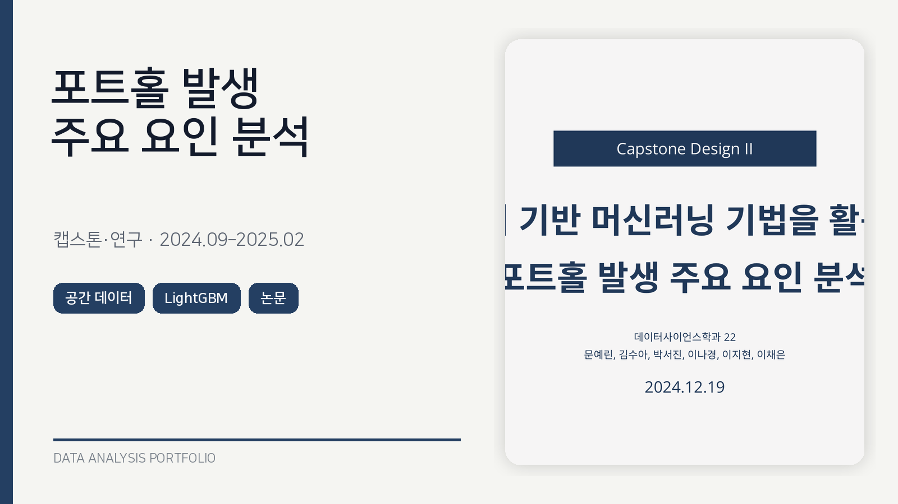
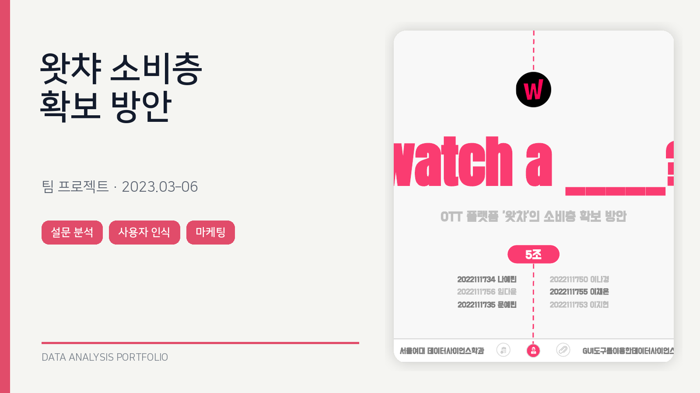
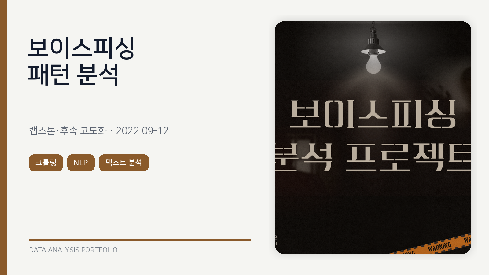
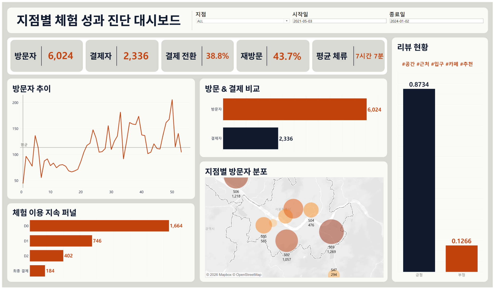

🇰🇷 **한국어** · 🇺🇸 English version coming soon

# 📂 Data Analysis Portfolio

안녕하세요, **데이터 분석가를 준비하고 있는 이지현**입니다.

이 저장소는 교과 프로젝트, 캡스톤 연구, 부트캠 프로젝트를 통해 수행한 데이터 분석 작업을 정리한 포트폴리오입니다.  
단순히 프로젝트 결과를 나열하기보다, **문제를 정의하고 데이터를 검증한 뒤 분석 결과를 실행 가능한 다음 단계로 연결하는 과정**을 기록했습니다.

> **Turning complex data into clear insights and practical next steps.**  
> 복잡한 데이터를 명확한 인사이트와 실행 가능한 다음 단계로 연결합니다.

  
  
  
  
  
  
  

---

## 👩‍💻 About Me

데이터를 통해 사용자 행동과 서비스의 문제를 구체적인 질문으로 바꾸고, 분석 결과를 실제 개선 방향으로 연결하는 과정에 관심이 있습니다.

공공 안전과 도시 데이터, 제품·사용자 행동, 전환·리텐션, 머신러닝, 텍스트 분석, AI 윤리 등 다양한 주제를 다뤄왔습니다. 프로젝트를 진행할 때는 **데이터 정의와 전처리 기준을 먼저 확인하고, 관찰된 관계와 인과를 구분하며, 분석 결과를 대시보드·보고서·발표 자료로 명확하게 전달하는 것**을 중요하게 생각합니다.

- **Business Question Structuring** — 모호한 문제를 측정 가능한 분석 질문과 지표로 구체화
- **User Behavior Analysis** — 퍼널, 세그먼트, 리텐션 분석을 통한 전환·이탈 병목 탐색
- **Data Validation** — 데이터 정의, 결측치, 중복, 조인 관계와 분석 가정 검증
- **Evidence-Based Analysis** — 통계적 추론과 머신러닝을 활용하되 연관·예측·인과를 구분
- **Visualization & Storytelling** — 복잡한 결과를 대시보드와 구조화된 스토리로 전달
- **Actionable Recommendations** — 분석 결과를 실험, 운영 개선, 서비스 전략으로 연결

---

## 📌 Project Summary

| 프로젝트명 | 프로젝트 타입 | 기간 | 메인 포커싱 분석 | 메인 스킬 | 레포 링크 |
|---|---|---:|---|---|---|
| **공유오피스 무료체험 전환 체계 진단** | 부트캠 팀 프로젝트 | 2026.07 | 무료체험 퍼널, 반복 방문 전환 신호, 지점별 병목 진단 | Python, Funnel Analysis, Statistical Testing, ML, Tableau | - |
| **구독형 교육 서비스 전환·리텐션 분석** | 부트캠 팀 프로젝트 | 2026.06 | 첫 결제 전환, 학습 행동 세그먼트, 정기결제 유지 | Python, User Segmentation, Retention, A/B Test Design | - |
| **서울시 지하철 사고 원인 분석 및 안전 개선** | 부트캠 팀 프로젝트 | 2026.04 | 사고 유형별 시간·공간·구조적 위험 요인 분석 | Python, EDA, Public Data, Correlation Analysis, Tableau | - |
| **ToxMod AI 윤리 영향평가** | 교과 팀 프로젝트 | 2025.09–12 | 음성 중재 AI의 프라이버시·공정성·투명성 평가 | AI Ethics, Risk Analysis, Impact Assessment, Policy Review | - |
| **Steam 게임 속성 기반 인기 게임 예측** | 교과 개인 프로젝트 | 2025.03–06 | 게임 속성을 활용한 상위 다운로드 게임 분류 | Orange3, Decision Tree, Classification, Model Evaluation | - |
| **포트홀 발생 주요 요인 분석** | 캡스톤·연구 팀 프로젝트 | 2024.09–2025.02 | 공간·기상·교통 데이터 통합 및 발생 요인 중요도 분석 | Python, Spatial Data, Feature Engineering, LightGBM | [Repository](https://github.com/lucyjeehyeon/pothole-risk-factor-analysis) |
| **OTT 플랫폼 왓챠 소비층 확보 방안** | 교과 팀 프로젝트 | 2023.03–06 | 자체 설문 기반 사용자 인식·이용 요인 및 마케팅 방향 | Survey Analysis, User Behavior, Statistical Analysis, Strategy | - |
| **보이스피싱 패턴 분석** | 캡스톤·연계 실습 팀 프로젝트 | 2022.09–12 후속 고도화 | 사례 스크립트·유튜브 데이터 수집 및 텍스트 패턴 분석 | Crawling, Text Preprocessing, KoNLPy, WordCloud, Sentiment | [Repository](https://github.com/lucyjeehyeon/voicefishing_analysis) |

---

## 🖼 Project Gallery

<table>
<tr>
<td width="50%" valign="top">

### 🏢 공유오피스 무료체험 전환 분석

**긴 체류보다 서로 다른 날짜까지 이어진 반복 방문이 결제 전환과 더 일관되게 연결됨을 확인했습니다.**

`퍼널 분석` `행동 분석` `통계 검정` `지점 진단` `Tableau`

[프로젝트 상세 보기](#project-shared-office)

</td>
<td width="50%" valign="top">

### 📚 구독형 교육 서비스 전환·리텐션 분석

**첫 결제 전에는 레슨 7회 완료, 결제 후에는 학습 활동일수가 핵심 행동 신호로 관찰되었습니다.**

`퍼널` `세그먼트` `리텐션` `수익 기여도` `A/B 테스트`

[프로젝트 상세 보기](#project-subscription)

</td>
</tr>
<tr>
<td width="50%" valign="top">

### 🚇 서울시 지하철 사고 원인 분석

**사고 유형에 따라 혼잡·환승 구조·곡선 승강장·연단 간격·노후도·기상이 다르게 작용하는 패턴을 분석했습니다.**

`공공데이터` `EDA` `상관분석` `안전 전략` `Tableau`

[프로젝트 상세 보기](#project-subway)

</td>
<td width="50%" valign="top">

### 🛡️ ToxMod AI 윤리 영향평가

**게임 음성 중재 AI를 프라이버시·공정성·투명성 관점에서 평가하고 개선 과제를 제안했습니다.**

`AI Ethics` `Privacy` `Fairness` `Transparency` `Risk Assessment`

[프로젝트 상세 보기](#project-toxmod)

</td>
</tr>
<tr>
<td width="50%" valign="top">

### 🎮 Steam 인기 게임 예측

**가격·평점·리뷰·난이도 등 게임 속성을 이용해 다운로드 수 상위 25% 게임을 분류했습니다.**

`Orange3` `Decision Tree` `Confusion Matrix` `ROC-AUC`

[프로젝트 상세 보기](#project-steam)

</td>
<td width="50%" valign="top">

### 🛣️ 포트홀 발생 주요 요인 분석

**33만 건 이상의 공간·기상·교통 데이터를 통합해 포트홀 발생의 주요 요인을 분석하고 논문으로 확장했습니다.**

`Spatial Data` `XGBoost` `LightGBM` `CatBoost` `Research Paper`

[프로젝트 상세 보기](#project-pothole)

</td>
</tr>
<tr>
<td width="50%" valign="top">

### 🎬 왓챠 소비층 확보 방안

**자체 설문과 외부 자료를 바탕으로 이용·비이용 이유와 서비스 인식을 분석해 소비층 확보 전략을 제안했습니다.**

`Survey` `User Perception` `Statistical Analysis` `Marketing Strategy`

[프로젝트 상세 보기](#project-watcha)

</td>
<td width="50%" valign="top">

### 📞 보이스피싱 패턴 분석

**사례 스크립트와 유튜브 데이터를 수집·정제해 반복적으로 등장하는 키워드와 텍스트 패턴을 탐색했습니다.**

`Crawling` `KoNLPy` `WordCloud` `Sentiment Analysis` `NLP`

[프로젝트 상세 보기](#project-voice-phishing)

</td>
</tr>
</table>

---

## 🛠 Skills Demonstrated

| 영역 | 수행 역량 | 관련 프로젝트 |
|---|---|---|
| **Data Preparation & Validation** | 데이터 정의 검토, 결측·중복 처리, 조인 키 검증, 파생변수 설계, 분석용 마트 구축 | 공유오피스, 구독 서비스, 지하철, 포트홀, 보이스피싱 |
| **Product & User Behavior Analytics** | 퍼널 분석, 행동 세그먼트, 전환 병목, 리텐션·갱신, 지점별 성과 진단 | 공유오피스, 구독 서비스, 왓챠 |
| **Statistics & Experiment Design** | 비율 비교, 카이제곱·상관분석, 신뢰구간, 다중검정, A/B 테스트 설계 | 공유오피스, 구독 서비스, 지하철, 왓챠 |
| **Machine Learning** | 분류 모델링, 트리 기반 모델 비교, 시계열 수요 예측, 임계값 조정, 변수 중요도 해석 | 공유오피스, Steam, 포트홀 |
| **Spatial & Public Data Analysis** | 공간 좌표·도로 링크 매핑, 공공데이터 통합, 외부 환경 변수 결합 | 공유오피스, 지하철, 포트홀 |
| **Text, NLP & Survey Analysis** | 웹 크롤링, 한국어 전처리, 명사 추출, 워드클라우드, 감성 분석, 설문 분석 | 보이스피싱, 왓챠, 공유오피스 리뷰 분석 |
| **AI Ethics & Risk Analysis** | 이해관계자 분석, 프라이버시·공정성·투명성 평가, 윤리적 딜레마 및 개선안 도출 | ToxMod |
| **Visualization & Communication** | Tableau 대시보드, 데이터 시각화, 분석 스토리라인, 보고서·논문·발표자료 작성 | 공유오피스, 구독 서비스, 지하철, 포트홀, 보이스피싱 |
| **Collaboration & Documentation** | 전처리 기준 명세화, 코드 통합, 역할 조율, 협업 기록, 발표·Q&A 준비 | 팀 프로젝트 전반 |

---

## 🗂 Portfolio Categories

| 카테고리 | 프로젝트 |
|---|---|
| 📊 **Product & User Behavior Analytics** | 공유오피스 무료체험 전환, 구독형 교육 서비스 전환·리텐션, 왓챠 소비층 확보 |
| 🚇 **Public Safety & Urban Analytics** | 서울시 지하철 사고 원인 분석, 포트홀 발생 주요 요인 분석 |
| 🤖 **Machine Learning & Predictive Modeling** | 포트홀 발생 요인 분석, Steam 인기 게임 예측, 공유오피스 방문 수요 예측 |
| 🌐 **Spatial & External Data Integration** | 공유오피스 지점 분석, 서울시 지하철 사고 분석, 포트홀 발생 요인 분석 |
| 📝 **Text, NLP & Survey Analysis** | 보이스피싱 패턴 분석, 왓챠 소비층 확보, 공유오피스 리뷰 분석 |
| 🛡️ **Risk, Ethics & Social Data Analysis** | ToxMod AI 윤리 영향평가, 보이스피싱 패턴 분석 |
| 📈 **Dashboard & Data Storytelling** | 공유오피스 지점 성과 대시보드, 서울시 지하철 안전 대시보드, 프로젝트 발표자료 |

---

# 🌟 Featured Projects

## 1. 공유오피스 무료체험 전환 체계 진단

**프로젝트 타입:** 부트캠 팀 프로젝트  
**기간:** 2026.07  
**역할:** 외부 데이터 전처리, 다지점 이용 분석, 지점별 성과·상권 분석, 공통 전처리 및 코드 검증 참여  
**상태:** 포트폴리오 문서화 완료 / 별도 레포 정리 예정

> **핵심 결과:** 무료체험 결제 전환과 가장 일관되게 연결된 행동은 한 번 오래 머무는 것이 아니라, 서로 다른 날짜까지 이용이 이어지는 **반복 방문**이었습니다.

| 문제 | 접근 | 결과 |
|---|---|---|
| 신청·방문은 안정적인데 결제 전환율이 급락한 원인은 무엇인가? | 변화점 탐지와 신청→방문→결제 퍼널 분해 | 2023년 9월 이후 병목은 방문이 아니라 **방문→결제 단계**에서 발생 |
| 결제자와 미결제자의 체험 행동은 어떻게 다른가? | 체류시간, 방문일수, 다지점 이용, 시간대, 랜드마크 모델 비교 | 단일 지점에서도 여러 날짜 방문자의 결제율이 1일 방문자보다 **8.38%p 높게 관찰** |
| 지점 성과 차이는 어디에서 발생하는가? | 행동·결제, 유동인구·인프라, 지도·블로그 리뷰 통합 | 지점을 순위화하지 않고 **유입·경험·전환 병목**으로 분리 진단 |

<b>🔍 분석 내용 자세히 보기</b>

### 데이터 및 분석

- 신청자 **9,624명**, 방문자 **6,026명**의 무료체험 행동·결제 데이터
- 신청 → 방문 → 결제 단계별 퍼널 및 시계열 변화점 탐지
- 체류시간, 방문일수, 체크인 수, 대표 이용 시간대, 다지점 이용 변수 생성
- 반복 방문과 다지점 이용의 영향을 구분하기 위한 층화 분석 및 로지스틱 회귀
- D0·D1·D2 행동을 순차적으로 추가한 랜드마크 모델로 전환 신호 발생 시점 점검
- 지점 반경 1km의 지하철 유동인구·주변 인프라 및 지도·블로그 리뷰 결합
- PCA·군집화 및 지점별 유입·경험·전환 성과 진단

### 주요 인사이트

- 결제 전환율은 변화점 이전 **39.6%**에서 이후 **25.8%**로 하락
- 한 번 길게 이용한 집단보다 짧더라도 여러 날짜 방문한 집단의 결제율이 **22.02%p 높게 관찰**
- 다지점 이용의 원본 결제율 우위는 방문일수·행동량을 보정하면 크게 축소
- D1 행동이 추가될 때부터 전환 신호가 상대적으로 강화되어 **두 번째 날짜 방문 전후**가 실무적 개입 시점으로 해석됨
- 입지의 절대 유동량보다 평일·주말 유동 패턴과 실제 체험 수요 패턴의 적합성이 중요

### 제안

- D1 재방문 예약과 행동 완료 후 보상을 결합한 **Evening Return Pass**
- 체험 단계에서는 재방문을, 결제 이후에는 복수 지점 이용과 번들 혜택을 제공하는 단계별 락인 구조
- 지점별로 유입 포착, 수익화·온보딩, 구조 재검토, 운영 모델 표준화 전략을 차등 적용

<b>🙋‍♀️ 담당 역할 및 회고</b>

- 외부 데이터 수집·전처리 및 지점 반경 기준 데이터 결합
- 다지점 이용과 반복 방문의 관계를 비교하고 통제 변수를 추가해 해석 보완
- 지점별 수요·입지·인프라·리뷰 분석 및 그룹별 운영 전략 도출
- 공통 전처리 명세, 마스터 테이블 검증, 코드 통합 과정 참여
- 분석 결과를 인과로 단정하지 않고 관찰된 관계와 실험이 필요한 가설을 구분하는 중요성을 학습

---

## 2. 구독형 교육 서비스 전환·리텐션 분석

**프로젝트 타입:** 부트캠 팀 프로젝트  
**기간:** 2026.06  
**역할:** 첫 결제 이후 정기결제 전환·유지 분석, 학습 지속성 세그먼트, 플랜별 수익 기여도 분석  
**상태:** 포트폴리오 문서화 완료 / 별도 레포 정리 예정

> **핵심 결과:** 첫 결제 전환에는 초기 학습 도달 수준이, 정기결제 유지에는 결제 이후 학습이 이어진 **활동일수**가 더 중요한 신호로 관찰되었습니다.

| 문제 | 접근 | 결과 |
|---|---|---|
| 무료체험 폐지 후 첫 결제율 하락을 어떻게 개선할 수 있는가? | 결제 전 7일 행동과 30일 내 첫 결제율 비교 | **레슨 7회 완료**를 1차 운영 목표 지점으로 선정 |
| 같은 비학습 유저라도 전환 가능성은 같은가? | 콘텐츠 경험 여부와 레슨 완료 수로 4개 세그먼트 정의 | 무행동형 1.08% vs 탐색형 10.98%로 큰 전환 차이 관찰 |
| 첫 결제 후 어떤 행동이 갱신과 연결되는가? | 결제 후 학습 활동일수 기반 저·중·고활동 세그먼트 | 60일 내 갱신율이 **48.0% → 56.9% → 63.2%**로 상승 |

<b>🔍 분석 내용 자세히 보기</b>

- 무료체험 폐지 전후 가입자, 첫 결제율, 결제금액, 할인, 초기 행동 변화 비교
- 결제 전 7일 이내 레슨 완료 수와 30일 내 첫 결제율 분석
- 콘텐츠 경험 여부와 레슨 완료 수를 활용해 무행동형·탐색형·약한 학습형·강한 학습형 정의
- 결제 후 학습 횟수보다 학습이 이어진 기간을 반영하기 위해 학습 활동일수 세그먼트 구성
- 결제 플랜별 유저 비중과 기대 수익 기여도 비교
- 무행동형을 탐색형으로 이동시키는 온보딩 A/B 테스트와 기대 매출 시뮬레이션 설계

### 실행 방향

- 무행동형: 초보자 맞춤 콘텐츠와 원클릭 시작 CTA로 첫 콘텐츠 경험 유도
- 약한 학습형: 다음 행동 안내와 동기부여 메시지로 레슨 7회 완료 유도
- 결제자: 경험치·리워드와 반복 방문 장치로 학습 활동일수 확대

<b>⚠️ 해석의 한계</b>

- 광고 채널·유입 품질 데이터 부재로 무료체험 폐지 전후의 유저 구성 변화를 분리하기 어려움
- 조회 없이 시작이 집계되는 등 이벤트 로그 정의가 다른 지점이 존재
- 실제 플랜 정책과 결제 주기 정보가 없어 플랜별 갱신 구조는 추가 검증 필요
- 행동과 결제의 관계는 인과가 아니므로 실행 효과는 A/B 테스트로 검증해야 함

---

## 3. 서울시 지하철 사고 원인 분석 및 안전 개선 방안

**프로젝트 타입:** 부트캠 팀 프로젝트  
**기간:** 2026.04  
**역할:** 팀 공통 데이터 분석, 결과 시각화·정리, 안전 개선안 및 발표자료 구성 참여  
**상태:** 포트폴리오 문서화 완료 / 별도 레포 정리 예정

> **핵심 결과:** 사고를 하나의 원인으로 설명하기보다, 사고 유형에 따라 시간적·공간적·구조적 위험 요인이 다르게 결합되는 양상을 분석했습니다.

| 분석 대상 | 주요 관찰 | 개선 방향 |
|---|---|---|
| 열차 내 사고 | 출근 시간대·환승 거점과 곡선 선형, 노후 역사에서 위험 패턴 관찰 | 혼잡 관리, 수직 지지봉 확충, 흔들림 저감 장치 검토 |
| 역 구내 사고 | 출근 시간대 사고 밀도가 높고 대형 환승역에 사고 편중 | 시간대별 인력 배치와 복잡 동선 구간 집중 관리 |
| 출입문·발빠짐 | 곡선 승강장, 넓은 연단 간격, 오래된 역사에서 사고 비중 증가 | 연단 간격 위험 구간 우선 개선과 안내 강화 |
| 승강설비 사고 | 시설 규모·노후도와 강수 등 외부 환경을 함께 검토 | 날씨 연동 점검과 설비별 예방 정비 |

<b>🔍 분석 내용 자세히 보기</b>

- 최근 5년간 서울교통공사 안전사고 데이터를 사고 유형별로 분류
- 승하차 인원, 혼잡도, 승강장 유형·선형, 연단 간격, 준공연도, 안전문, 승강설비, 기상 데이터 결합
- 역명 기준 데이터 전처리·병합 및 사고 유형별 12개 분석 가설 검토
- 단순 사고 건수와 시간당 사고 밀도를 구분해 시간대별 위험 비교
- 호선·역·환승 여부·곡선 선형·시설 노후도와 사고 패턴 시각화
- Tableau를 활용한 인터랙티브 안전사고 대시보드 구성

### 프로젝트 피드백에서 확인한 강점

- 사고 데이터에 기상·혼잡도·시설 특성을 함께 결합한 다각적 접근
- 호선별 색상과 지하철 콘셉트를 활용한 일관된 시각화
- 사용자가 조건을 선택해 확인할 수 있는 인터랙티브 대시보드

<b>💡 회고</b>

분석 내용이 풍부했던 만큼 핵심 결론을 먼저 제시하고, 유의미하지 않거나 중복되는 분석은 과감하게 축약해야 전달력이 높아진다는 점을 배웠습니다. 또한 복잡한 동선이나 혼잡도처럼 정의에 따라 결과가 달라질 수 있는 변수는 측정 기준을 더 명확히 제시할 필요가 있었습니다.

---

## 4. ToxMod AI 윤리 영향평가

**프로젝트 타입:** 교과 팀 프로젝트  
**기간:** 2025.09–12  
**역할:** 평가 대상 아이디어 제안 및 초기 방향 설정, 윤리 원칙별 조사·평가와 개선안 도출 참여  
**상태:** 보고서 정리 완료

> **핵심 결과:** 유해 발언 탐지 성능만이 아니라, 음성 데이터 수집과 자동 제재가 이용자의 권리·신뢰에 미치는 영향을 함께 평가해야 한다는 점을 확인했습니다.

| 평가 원칙 | 주요 쟁점 | 제안 |
|---|---|---|
| 프라이버시·데이터 거버넌스 | 민감한 음성 데이터의 별도 동의, 아동 보호, 저장 암호화의 투명성 | 별도 동의, 보호자 인증, 암호화 정책 공개 |
| 공정성 | 억양·비원어민 발화·문화적 맥락에 따른 오탐과 누적 제재 위험 | 대표성 있는 데이터, 집단별 성능 모니터링, 단계적 인간 검토 |
| 투명성 | 사용자가 제재 사유와 판단 기준을 충분히 이해하기 어려움 | 구체적 사유 제공, 이의제기 접근성 강화, 외부 감사와 투명성 보고서 |

<b>🔍 평가 내용 자세히 보기</b>

- Activision이 게임 내 음성 채팅 관리에 도입한 ToxMod Voice Moderation AI 사례 분석
- 공식 정책·FAQ·기술 문서, 학술 연구, 국내외 법·가이드라인을 바탕으로 질적 영향평가
- 개발사, 운영사, 게임 이용자, 아동·청소년, 스트리머, 규제기관, 시민사회 등 이해관계자 분석
- 이용자 보호와 표현의 자유가 충돌하는 윤리적 딜레마 정리
- AI의 1차 탐지 후 인간 검토를 거치는 단계적 제재 구조와 정기적 외부 검증 제안

---

## 5. Steam 게임 속성 기반 인기 게임 예측

**프로젝트 타입:** 교과 개인 프로젝트  
**기간:** 2025.03–06  
**역할:** 문제 정의, 데이터 정제, 타깃 설계, Orange3 워크플로 구축, 모델 평가 전 과정  
**상태:** 개인 프로젝트 보고서 완료

> **핵심 결과:** 구조화된 게임 속성을 이용해 다운로드 수 기준 상위 25% 게임 여부를 분류했으며, Decision Tree에서 약 **86% 정확도**와 약 **0.96 ROC-AUC**를 확인했습니다.

### 프로젝트 구성

- **데이터:** Kaggle `Best-Selling Steam Games of All Time`, 게임 2,380개
- **주요 변수:** 가격, 리뷰, 평점, 난이도, 연령 제한 등 7개 속성
- **타깃:** 다운로드 수 기준 상위 25% 여부인 `top_downloaded`
- **워크플로:** File → Select Columns → Logistic Regression·Tree → Test & Score → Confusion Matrix
- **평가:** 정확도, 혼동행렬, ROC Curve

<b>📊 결과 및 활용 방향</b>

- Decision Tree 혼동행렬: TN 477, FP 52, FN 22, TP 163
- 게임 출시 전 속성을 이용해 상위 인기 그룹 가능성을 탐색하는 프로토타입
- 가격 전략, 마케팅 타깃 설정, 플랫폼 내 홍보 우선순위에 활용 가능
- 후속 분석으로 리뷰 텍스트와 사용자 태그를 추가해 설명력을 높일 수 있음

---

## 6. 트리 기반 머신러닝을 활용한 포트홀 발생 주요 요인 분석

**프로젝트 타입:** 캡스톤·연구 팀 프로젝트  
**기간:** 2024.09–2025.02  
**역할:** 데이터 전처리, 특성 설계, 머신러닝 모델링, 논문 작성 참여  
**링크:** [Repository](https://github.com/lucyjeehyeon/pothole-risk-factor-analysis) · [논문](https://www.dbpia.co.kr/journal/articleDetail?nodeId=NODE12132267)  
**성과:** 2025년도 한국통신학회 동계종합학술발표회 발표 및 논문 게재

> **핵심 결과:** LightGBM이 포트홀 발생 클래스에서 **F1-Score 0.81**로 가장 균형 잡힌 성능을 보였으며, 풍속·유입·유출 교통량·버스 노선 수·기상 요인이 주요 변수로 나타났습니다.

| 데이터 | 방법 | 결과 |
|---|---|---|
| 포트홀, 도로 네트워크·특성, 위험 지수, 돌발상황, 교통량, 버스, 기상 | 공간 좌표·도로 링크 매핑, 월 단위 통합, 언더샘플링, GridSearchCV | 최종 **333,858건·37개 변수**, LightGBM 정확도 78%, F1 0.81 |

<b>🔍 연구 내용 자세히 보기</b>

- 2022년 12월부터 2024년 1월까지 서울시 포트홀 및 관련 데이터 통합
- 주소를 위·경도로 변환하고 도로 네트워크 링크와 매핑
- 연속형 결측값 평균 대체, 범주형 최빈값 처리 및 원-핫 인코딩
- 포트홀 발생·미발생 클래스 불균형을 1:1 언더샘플링으로 조정
- XGBoost, LightGBM, CatBoost 모델 비교 및 Precision-Recall Curve 기반 임계값 조정
- 변수 중요도를 이용해 예방적 도로 유지보수에 참고할 위험 요인 해석

### 연구 의의

- 탐지 이후의 사후 대응이 아니라 발생 가능성이 높은 도로 구간을 선제적으로 관리하는 관점 제시
- 여러 기관의 공간·교통·기상 데이터를 도로 구간과 월 단위로 통합한 분석 경험
- 캡스톤 결과를 학술대회 발표와 논문 게재까지 확장

---

## 7. OTT 플랫폼 왓챠의 소비층 확보 방안

**프로젝트 타입:** 교과 팀 프로젝트  
**기간:** 2023.03–06  
**역할:** 팀원, 설문 결과 분석 및 마케팅·서비스 개선 방향 도출 참여  
**상태:** 발표자료 정리 완료

> **핵심 결과:** 자체 설문을 통해 왓챠의 이용·비이용 이유와 서비스 인식을 분석하고, 차별화된 부가서비스 홍보와 타깃 마케팅 방향을 제안했습니다.

### 데이터 및 분석

- 자체 설문조사 **97건**과 KOSIS 등 외부 통계자료
- 왓챠 인지도, 구독 의향, 이용·비이용 이유, 콘텐츠 선호, 부가서비스 인식 분석
- 성별·연령별 특성과 인지도·구독 의향 비교
- 넷플릭스·티빙의 콘텐츠 및 마케팅 사례 벤치마킹

### 주요 제안

- 오리지널·대중적 콘텐츠와 장르 다양성 부족 문제 개선
- 왓챠만의 추천·평가·부가서비스 차별점 홍보
- 2030 여성 등 주요 이용 집단을 고려한 타깃 메시지
- 무료 콘텐츠·프로모션과 계정 공유 강점을 활용한 진입 장벽 완화

---

## 8. 보이스피싱 패턴 분석

**프로젝트 타입:** 캡스톤·연계 실습 팀 프로젝트  
**기간:** 2022.09–12, 후속 연계 실습에서 고도화  
**역할:** 데이터 수집, 문서 변환·병합, 한국어 텍스트 전처리, 키워드·패턴 분석  
**링크:** [Repository](https://github.com/lucyjeehyeon/voicefishing_analysis)

> **핵심 결과:** 초기 캡스톤에서 데이터 수집과 프로토타입 분석을 수행한 뒤, 후속 연계 실습에서 전처리 파이프라인과 텍스트 분석을 보완했습니다.

### 데이터

- 보이스피싱 사례 영상에서 수집한 **185개 `.doc` 스크립트**
- 유튜브 보이스피싱 관련 영상의 제목·설명·키워드 등 크롤링 데이터

<b>🔍 처리 과정 및 분석</b>

#### Script Data

- `.doc` 파일을 `.docx`로 변환
- 여러 문서를 하나의 DataFrame으로 병합
- 한글 정제와 불용어 제거
- KoNLPy를 활용한 명사 추출
- 상위 100개 명사 기반 워드클라우드 시각화

#### YouTube Data

- 보이스피싱 관련 영상 데이터 크롤링
- 중복 제거 및 장난·코미디·몰래카메라 등 비관련 콘텐츠 필터링
- 설명·키워드 워드클라우드
- VaderSentiment 기반 감성 분석
- 키워드 기반 예측 모델 프로토타입

### 회고

노이즈가 많은 비정형 데이터를 분석 가능한 형태로 만드는 전처리의 중요성을 처음으로 체감한 프로젝트입니다. 초기 캡스톤 결과를 후속 실습에서 다시 정리하며 문서 변환, 병합, 정제, 형태소 분석, 시각화까지 이어지는 텍스트 분석 파이프라인을 경험했습니다.

---

# 🗃 Repository Status

현재 포트폴리오에는 **8개 프로젝트의 문제 정의, 분석 과정, 주요 결과와 역할**을 정리했습니다.

- 공개 레포가 있는 프로젝트: 포트홀 발생 주요 요인 분석, 보이스피싱 패턴 분석
- 나머지 프로젝트: 포트폴리오 요약을 먼저 제공하고 있으며, 공개 가능한 코드·산출물을 순차적으로 별도 레포로 정리할 예정입니다.
- 프로젝트 데이터는 라이선스·보안·교육용 제공 조건에 따라 원본 공개가 제한될 수 있습니다.

---

# 📫 Contact

- **GitHub:** [github.com/lucyjeehyeon](https://github.com/lucyjeehyeon)
- **LinkedIn:** [linkedin.com/in/jeehyeon-lee-6100a9223](https://www.linkedin.com/in/jeehyeon-lee-6100a9223)
- **Email:** lucy567888@gmail.com

